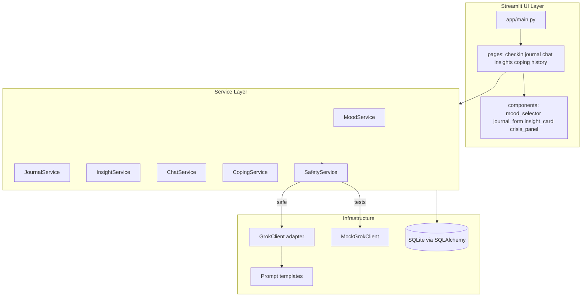
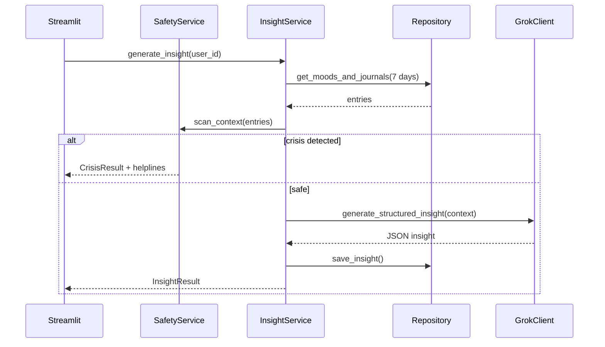
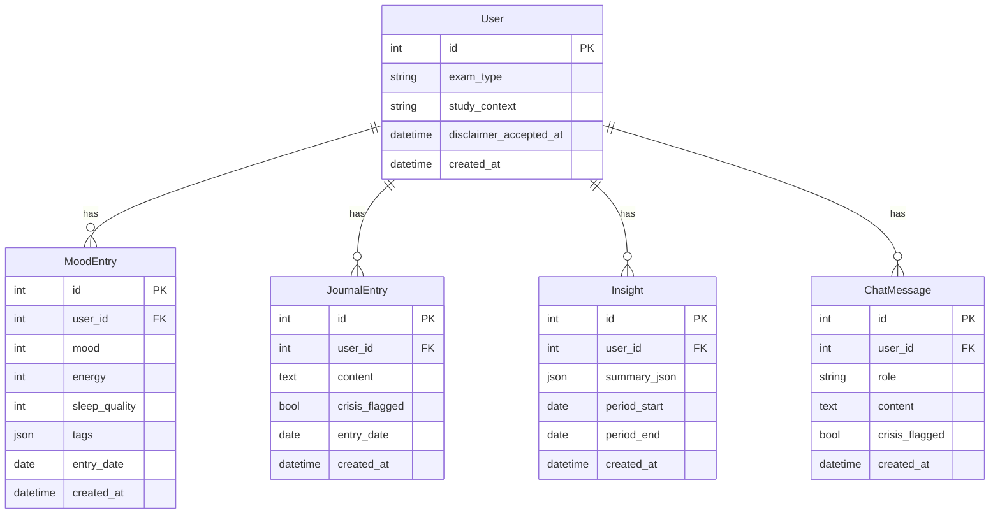

# Technical Design

> **Project:** Mental Wellness Tracker  
> **Status:** Draft  
> **PRD:** docs/prd.md  
> **Last updated:** 2026-06-13

## 1. Architecture Overview



**Request flow (insight generation):**



## 2. Tech Stack

| Layer | Choice | Rationale |
|-------|--------|-----------|
| Frontend | Streamlit 1.x | Rapid Python UI; fits solo-dev MVP |
| Backend | Python 3.10+ services | Same language as UI; modular testing |
| Database | SQLite + SQLAlchemy 2.x | Local-first; zero config; migrates to Postgres later |
| LLM | xAI Grok via `openai` SDK | OpenAI-compatible; `grok-4.1-fast` for cost efficiency |
| Validation | Pydantic v2 | Schema for settings, insight JSON, API payloads |
| Charts | Altair | Declarative; accessible text summaries alongside |
| Testing | pytest, pytest-mock | Standard Python testing |
| Linting | ruff, mypy | Code quality per AGENTS.md |

**Trade-offs:**

- Streamlit limits accessibility and custom UX vs React — mitigated with labels, contrast CSS, text alternatives.
- SQLite single-writer — acceptable for local single-user MVP.
- Grok API has per-token cost — mitigated with context summarization and turn limits.

## 3. Repository Structure

```
.
├── app/
│   ├── main.py
│   ├── config.py
│   ├── styles.py              # high-contrast CSS
│   ├── pages/
│   │   ├── 1_checkin.py
│   │   ├── 2_journal.py
│   │   ├── 3_insights.py
│   │   ├── 4_chat.py
│   │   ├── 5_coping.py
│   │   └── 6_history.py
│   └── components/
│       ├── crisis_panel.py
│       ├── mood_form.py
│       └── insight_display.py
├── src/
│   ├── models/
│   │   ├── base.py
│   │   ├── user.py
│   │   ├── mood.py
│   │   ├── journal.py
│   │   ├── insight.py
│   │   └── chat.py
│   ├── repositories/
│   │   └── wellness_repository.py
│   ├── services/
│   │   ├── mood_service.py
│   │   ├── journal_service.py
│   │   ├── insight_service.py
│   │   ├── chat_service.py
│   │   └── coping_service.py
│   ├── llm/
│   │   ├── client.py          # GrokClient protocol + implementations
│   │   ├── prompts.py
│   │   └── schemas.py
│   ├── safety/
│   │   ├── crisis_detector.py
│   │   ├── disclaimers.py
│   │   └── helplines.py
│   └── utils/
│       ├── validation.py
│       ├── dates.py
│       └── logging.py
├── tests/
│   ├── unit/
│   ├── integration/
│   └── conftest.py
├── data/                      # gitignored SQLite file
├── docs/
├── .env.example
├── .gitignore
├── requirements.txt
├── pyproject.toml
└── README.md
```

## 4. Data Model

### ER Diagram



### SQLAlchemy Models

- All tables include `user_id` for future multi-user auth (FR-004, SEC-006).
- MVP seeds `User(id=1)` on first run.
- `MoodEntry.entry_date` and `JournalEntry.entry_date` enforce one-per-day upsert logic.
- `Insight.summary_json` stores: `{triggers, patterns, themes, suggestions}`.

## 5. API Contracts

### GrokClient Protocol

```python
class GrokClient(Protocol):
    def generate_insight(self, context: str, exam_type: str) -> InsightPayload: ...
    def chat(self, messages: list[ChatTurn], exam_type: str) -> str: ...
    def generate_coping(self, request_type: str, context: str, exam_type: str) -> str: ...
```

### InsightPayload (Pydantic)

```python
class InsightPayload(BaseModel):
    triggers: list[str]
    patterns: list[str]
    themes: list[str]
    suggestions: list[str]
```

### SafetyService

```python
class CrisisResult(BaseModel):
    is_crisis: bool
    matched_patterns: list[str]  # pattern names only, not logged with user text
```

### Repository Interface (key methods)

```python
def get_or_create_default_user() -> User
def upsert_mood_entry(user_id, mood, energy, sleep, tags, entry_date) -> MoodEntry
def upsert_journal_entry(user_id, content, crisis_flagged, entry_date) -> JournalEntry
def get_entries_since(user_id, days: int) -> tuple[list[MoodEntry], list[JournalEntry]]
def save_insight(user_id, summary_json, period_start, period_end) -> Insight
def get_latest_insight(user_id) -> Insight | None
def save_chat_message(user_id, role, content, crisis_flagged) -> ChatMessage
def get_chat_history(user_id, limit: int) -> list[ChatMessage]
def clear_user_data(user_id) -> None
```

## 6. Authentication and Authorization

**MVP:** No login. Single default user (`id=1`) created on first launch.

**Future-ready:**
- `user_id` on all data tables.
- Repository methods require `user_id` parameter.
- Session state will map to authenticated user after auth is added.

## 7. Frontend Structure

| Page | PRD refs | Key components |
|------|----------|----------------|
| `main.py` | FR-001 | Onboarding, disclaimer, sidebar nav |
| `1_checkin.py` | FR-002 | `mood_form.py` |
| `2_journal.py` | FR-003, FR-005 | `journal_form`, `crisis_panel` |
| `3_insights.py` | FR-007, FR-008 | `insight_display.py`, Altair chart |
| `4_chat.py` | FR-009 | Chat UI, turn counter |
| `5_coping.py` | FR-010 | Exercise type selector |
| `6_history.py` | FR-011 | Timeline table |

**Streamlit session state keys:**
- `disclaimer_accepted`, `user_id`, `chat_turns`, `chat_messages`, `crisis_active`

## 8. Backend Structure

### Service responsibilities

| Service | Responsibility |
|---------|----------------|
| `MoodService` | Validate ranges, upsert daily entry (FR-002) |
| `JournalService` | Validate length, crisis scan, persist (FR-003, FR-005) |
| `InsightService` | Aggregate context, call Grok, cache (FR-007, FR-014) |
| `ChatService` | Turn limits, context building, crisis gate (FR-009, FR-015) |
| `CopingService` | Generate exercises via Grok (FR-010) |
| `SafetyService` | Orchestrates crisis detection + output filtering (FR-005, SEC-010) |

### LLM prompt strategy

- System prompt: empathetic wellness companion; no diagnosis/medication; exam-aware support only.
- User content wrapped in `<user_content>` delimiters (SEC-004).
- Insight prompt requests JSON-only response; parsed and validated via Pydantic.
- Context limited to summarized last 7 days (efficiency).

## 9. Error Handling

- Custom exceptions: `ValidationError`, `CrisisDetectedError`, `LLMError`, `RateLimitError`.
- Services catch `LLMError` and return graceful fallback (cached insight).
- UI never shows stack traces; `st.error()` with plain language.
- Internal logging via `src/utils/logging.py` — excludes journal/chat content (SEC-002).

## 10. Logging and Observability

- Log level from `LOG_LEVEL` env (default `INFO`).
- Log: API call success/failure, latency, validation errors (no PII).
- Do not log: journal content, chat messages, API keys, crisis-matched text.

## 11. Environment Variables

| Variable | Required | Default | Description |
|----------|----------|---------|-------------|
| `XAI_API_KEY` | Yes (for LLM features) | — | xAI API key |
| `XAI_MODEL_CHAT` | No | `grok-4.1-fast` | Chat/coping model |
| `XAI_MODEL_INSIGHT` | No | `grok-4.1-fast` | Insight model |
| `DATABASE_URL` | No | `sqlite:///./data/wellness.db` | SQLAlchemy URL |
| `LOG_LEVEL` | No | `INFO` | Logging level |
| `MAX_JOURNAL_CHARS` | No | `5000` | Max journal length |
| `MIN_JOURNAL_CHARS` | No | `10` | Min journal length |
| `DAILY_CHAT_TOKEN_BUDGET` | No | `8000` | Approx token budget per session |
| `MAX_CHAT_TURNS` | No | `5` | Max user turns per session |
| `LLM_TIMEOUT_SECONDS` | No | `30` | API timeout |

## 12. Testing Strategy

### Unit tests (`tests/unit/`)

- `test_crisis_detector.py` — keyword/heuristic matching, false positive guards
- `test_validation.py` — mood ranges, journal length
- `test_prompts.py` — delimiter wrapping
- `test_schemas.py` — InsightPayload parsing
- `test_safety_output_filter.py` — banned phrase filtering

### Integration tests (`tests/integration/`)

- `test_repository.py` — CRUD, upsert, clear data
- `test_insight_service.py` — mocked Grok, cache fallback
- `test_chat_service.py` — turn limits, crisis block
- `test_journal_service.py` — crisis flag on save

### Test fixtures (`conftest.py`)

- In-memory SQLite database
- `MockGrokClient` returning canned JSON
- Sample mood/journal entries

## 13. Deployment

**MVP (local):**

```bash
python -m venv .venv
.venv\Scripts\activate        # Windows
pip install -r requirements.txt
copy .env.example .env        # add XAI_API_KEY
streamlit run app/main.py
```

**Future:** Streamlit Community Cloud with `secrets.toml` for `XAI_API_KEY`; PostgreSQL `DATABASE_URL`.

## 14. Security Considerations

| Risk | Mitigation |
|------|------------|
| API key exposure | Env only; `.env` gitignored; `.env.example` without values |
| Prompt injection | Delimiter wrapping; system prompt hardening; no tool execution |
| Harmful LLM advice | Crisis gate; system prompt constraints; output post-filter |
| Health data leakage | Local SQLite; no content logging; clear-data option |
| SQL injection | SQLAlchemy parameterized queries |
| Dependency vulnerabilities | Pinned versions; `pip-audit` in CI/manual check |

### Crisis resources (static)

- Tele-MANAS: 14416 / 1-800-891-4416
- iCall: +91-9152987821
- Vandrevala Foundation: 1860-2662-345 / 1800-233-3330
